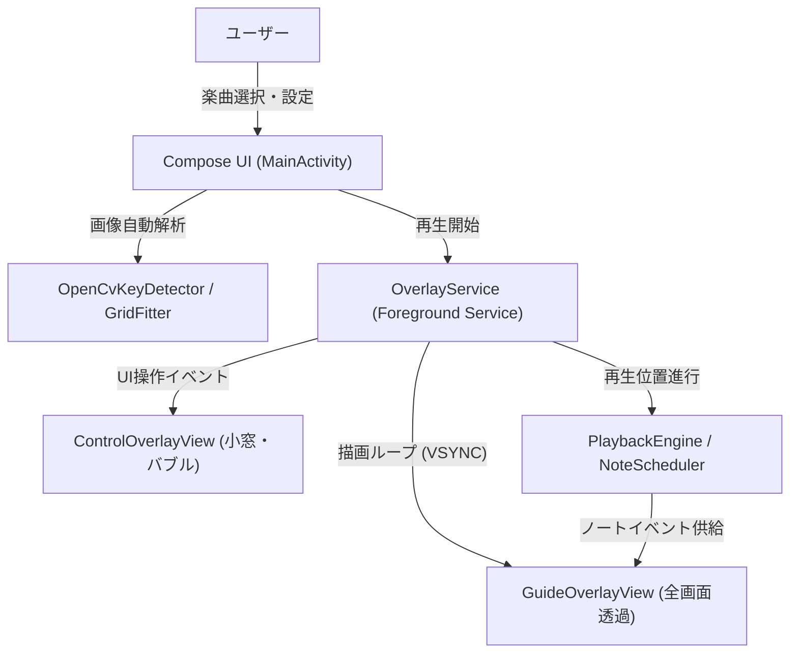

# KeyCue (キーキュー)

[](LICENSE)
[-green.svg)](https://developer.android.com)
[](https://kotlinlang.org)

**KeyCue** は、『Sky 星を紡ぐ子どもたち』の15キー楽器演奏をサポートする、Android向けフローティング演奏ガイド・練習支援アプリです。

ゲーム画面の上に透過オーバーレイを表示し、打鍵すべきキーやタイミング、音ゲー風の落下ノート（Falling Notes）やアプローチサークル、ジャスト演出をリアルタイムにガイドします。

---

## 主な機能

### 1. OpenCV による画面フィッティング & 微調整
- ゲーム内の楽器画面スクリーンショットから、OpenCV（輪郭・円形度解析）を用いて15キーの位置を自動検出。
- 検出結果はバイリニア補間（双線形補間）によって歪みやパースを考慮した高精度な格子座標を算出。
- 画面上の4隅ハンドル直接ドラッグや微調整D-Padによる手動補正にも対応。

### 2. 多彩な楽曲フォーマット対応
- **Sky Studio 形式 (`.json`)**: Sky Studio 公式およびコミュニティで作成された楽曲データに対応（※暗号化された譜面には非対応。暗号化ファイルを検出した場合はエラー通知と案内を表示）。
- **標準 MIDI 形式 (`.mid` / `.midi`)**: フォーマット0/1のマルチトラックMIDIに対応。メタイベント解析による自動テンポ追従および15キー音域へのスケールマッピング（自動調判定 / 手動キー・スケール指定）を搭載。

### 3. フローティング演奏ガイド (Guide Overlay)
- Android の `Choreographer`（VSYNC同期）による、カクつきのない約60fps超の滑らかな描画。
- **落下ノート (Falling Notes)**: 音ゲーライクに上から目標キーへ降下。行ごとに形状（○ / □ / △）とカラーが変化。
- **アプローチサークル**: 目標キーに向かって円が収縮し、ジャストタイミングを直感的に通知。
- **ジャストインパクト演出**: 打鍵タイミングに合わせたフラッシュ、二重リング、衝撃波紋（リップル）エフェクト。

### 4. フローティング操作コントローラー (Control Overlay)
- ゲーム画面を切り替えることなく、画面上で直接操作可能。
- **再生 / 一時停止 / シークバー / 10秒巻き戻し / 10秒早送り**。
- **再生速度の動的変更**: 0.25x 〜 2.0x（0.05刻み）で自由に変更可能。
- **楽曲ピッカー**: オーバーレイから直接別の曲を選択・切り替え。
- **最小化機能**: 演奏の邪魔にならない小さなフローティングバブルに最小化し、画面上の好きな位置へドラッグ移動可能。

---

## 画面イメージ・アーキテクチャ概要



---

## 動作要件

- **OS**: Android 10.0 (API レベル 29) 以上
- **必須権限**:
  - **ユーザー許可が必要な権限**:
    - `他のアプリの上に重ねて表示` (`android.permission.SYSTEM_ALERT_WINDOW`): ゲーム画面上にガイドやコントローラーを表示するために必須
    - `通知の送信` (`android.permission.POST_NOTIFICATIONS`): Android 13 (API 33) 以降で常駐通知を表示するために必須
  - **マニフェスト宣言権限**:
    - `フォアグラウンドサービス実行` (`android.permission.FOREGROUND_SERVICE`): ゲームプレイ中も安定してオーバーレイを常駐動作させるために使用
    - `特殊用途フォアグラウンドサービス` (`android.permission.FOREGROUND_SERVICE_SPECIAL_USE`): Android 14 (API 34) 以降の用途指定（演奏タイミング支援フローティングUI）

---

## インストール方法 (野良アプリ / APKサイドロード)

Google Play を経由せず、GitHub Releases 等から直接 APK をインストールして使用する手順です。

### 1. APK のダウンロード
1. スマートフォンのブラウザで本リポジトリの [Releases](https://github.com/onigiri-uma2/KeyCue/releases) ページを開きます。
2. 最新バージョンの Assets から `KeyCue-vx.x.apk`（または `app-debug.apk`）をタップしてダウンロードします。

### 2. 端末へのインストール（提供元不明のアプリの許可）
1. ダウンロードした APK ファイルを開きます。
2. 「**セキュリティ上の理由から、この提供元からの不明なアプリをインストールすることはできません**」という警告が表示された場合、**[設定]** をタップします。
3. **「この提供元のアプリを許可」** を **ON** にします。
4. 画面を戻り、**[インストール]** をタップして完了させます。

> [!TIP]
> **Android 13 以降で設定がブロックされる場合**  
> 一部端末では「制限された設定」と表示されることがあります。その場合は、端末の **[設定] > [アプリ] > [KeyCue]** を開き、右上のメニュー（︙）から **[制限付き設定を許可]** を選択してください。

### 3. 初回起動時の権限許可
アプリを初めて起動する際、以下の案内画面が表示されます：
1. **「他のアプリの上に重ねて表示」を許可**: 案内ボタンをタップして端末の設定画面を開き、一覧から **KeyCue** を探してスイッチを **ON** にします。
2. **通知の送信を許可**: ダイアログが表示されたら **[許可]** を選択します（演奏ガイド常駐サービスのために必要です）。

---

## 開発環境・ビルド手順

### 前提条件
- **JDK**: Java 17 以上 (Android Studio 付属の JBR 推奨)
- **Android Studio**: Ladybug / Meerkat 以降推奨
- **Android SDK**: `compileSdk = 37`, `minSdk = 29`

### ソースコードの取得
```bash
git clone https://github.com/onigiri-uma2/KeyCue.git
cd KeyCue
```

### Android Studio で開く場合
1. Android Studio を起動し、`Open` から本プロジェクトのルートディレクトリを選択します。
2. Gradle Sync が完了するのをお待ちください。
3. 実機またはエミュレータ（API 29以上）を接続し、`Run 'app'` を実行します。

### コマンドライン（CLI）でビルドする場合

#### デバッグ用 APK のビルド
- **Windows (PowerShell)**:
  ```powershell
  # 必要に応じて JAVA_HOME を設定
  $env:JAVA_HOME="C:\Program Files\Android\Android Studio\jbr"
  .\gradlew.bat assembleDebug
  ```
- **macOS / Linux**:
  ```bash
  ./gradlew assembleDebug
  ```
生成された APK は `app/build/outputs/apk/debug/app-debug.apk` に出力されます。

#### 本番用（Release）APK / AAB のビルド
- **APK のビルド**:
  ```bash
  # Windows
  .\gradlew.bat assembleRelease

  # macOS / Linux
  ./gradlew assembleRelease
  ```
  生成された APK は `app/build/outputs/apk/release/` に出力されます。

- **Google Play 配布用 AAB (Android App Bundle) のビルド**:
  ```bash
  # Windows
  .\gradlew.bat bundleRelease

  # macOS / Linux
  ./gradlew bundleRelease
  ```
  生成された AAB は `app/build/outputs/bundle/release/` に出力されます。

> [!NOTE]
> **本番用（Release）APK の署名について**  
> Release ビルドは Android 端末へのインストールやストア公開にキーストア（秘密鍵）による電子署名が必要です。
> - **Android Studio を使う場合（推奨）**: メニューの `Build` > `Generate Signed App Bundle / APK...` からキーストアを指定して簡単に署名済みビルドを作成できます。
> - **CLI を使う場合**: 未署名 APK をビルド後、Android SDK の `apksigner` ツールを用いて署名を行ってください。
> - ※ セキュリティ保護のため、キーストアファイル（`.jks` / `.keystore`）はリポジトリにコミットしないでください。

#### 単体テストの実行
すべてのロジック・パーサー・計算モジュールの単体テストを実行します。
```bash
# Windows
.\gradlew.bat testDebugUnitTest

# macOS / Linux
./gradlew testDebugUnitTest
```

#### 端末への直接インストール
```bash
# Windows
.\gradlew.bat installDebug

# macOS / Linux
./gradlew installDebug
```

---

## プロジェクト構成

```
KeyCue/
├── app/
│   ├── src/main/
│   │   ├── java/com/onigiri/keycue/
│   │   │   ├── app/           # Navigation, MainActivity
│   │   │   ├── data/          # 設定保存 (SettingsRepository)
│   │   │   ├── fitting/       # OpenCVキー認識, グリッド補間アルゴリズム
│   │   │   ├── model/         # データモデル (FitProfile, SongData, Config等)
│   │   │   ├── overlay/       # フローティングオーバーレイ, レンダラー
│   │   │   ├── playback/      # 再生エンジン, スケジューラー, 計算器
│   │   │   ├── song/          # MIDI & Sky Studio JSON パーサー, フォーマット判定
│   │   │   └── ui/            # Jetpack Compose 画面 (Home, Fitting, Preview)
│   │   └── res/               # アプリアイコン, テーマ, 文字列リソース
│   └── src/test/              # 単体テストコード群 (パーサー, 計算, ViewModel等)
├── docs/
│   ├── SPEC.md                # 詳細仕様書
│   └── ARCHITECTURE.md        # 設計・アーキテクチャ詳細ドキュメント
├── LICENSE                    # MIT License
└── README.md                  # 本ドキュメント
```

---

## ライセンス (License)

本プロジェクトは [MIT License](LICENSE) の下で公開されています。

```text
Copyright (c) 2026 onigiri-uma2
```

---

## 免責事項 (Disclaimer)

本アプリはファンによる非公式の練習支援ツールであり、『Sky 星を紡ぐ子どもたち』の開発・運営元である thatgamecompany とは一切関係ありません。
ゲームの利用規約に従って個人練習の用途でご利用ください。
