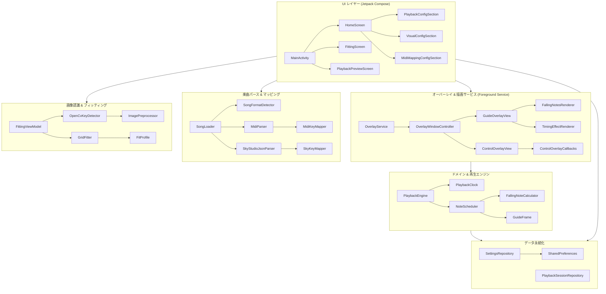

# KeyCue アーキテクチャ設計書 (ARCHITECTURE.md)

## 1. 設計原則

KeyCue は、高フレームレート（60fps超）の安定描画と保守性を両立するため、以下の設計原則に基づいて構成されています。

### 1.1 単一方向データフローと状態の集約 (Unidirectional Data Flow)
- アプリケーション全体の状態管理には Kotlin Coroutines の `StateFlow` を使用。
- ViewModel および Repository は不変（Immutable）なデータクラスを公開し、UIや描画層はそれを購読（Observe）して描画に専念します。

### 1.2 ファイルパーサーと再生エンジンの完全分離
- `PlaybackEngine` は楽曲の入力ファイル形式（MIDI、JSON等）を一切意識せず、正規化された `SongData`（`List<NoteEvent>`）のみを処理します。
- これにより、将来的な新フォーマット追加時も再生系コードに影響を与えません。

### 1.3 再生時計と描画タイミングの分離
- **論理時刻管理**: `PlaybackClock` がシステム時刻（`SystemClock.elapsedRealtime()`）に基づき、ポーズ・シーク・速度変化を加味した単調増加の現在再生位置（ミリ秒）を計算。
- **描画タイミング**: Android の `Choreographer` が端末のディスプレイリフレッシュレート（VSYNC）に同期してフレーム要求を発行。
- 描画周期と再生ロジックを分離することで、処理落ち時でも音飛びやタイミングずれが発生しない設計となっています。

### 1.4 Guide Overlay と Control Overlay の物理的分離
- **GuideOverlayView**: 全画面透過・タッチイベント完全透過（`FLAG_NOT_TOUCHABLE`）。ゲームのタッチ操作を一切妨害せず描画のみを担当。
- **ControlOverlayView**: 画面上の小窓または最小化バブル（`FLAG_NOT_FOCUSABLE`）。再生操作やシークを受け付け、ゲーム操作を妨げない位置へ自由にドラッグ可能。

---

## 2. 全体アーキテクチャ概要



---

## 3. パッケージ構成 (`com.onigiri.keycue`)

```text
com.onigiri.keycue
├── app/
│   ├── MainActivity.kt                 # メイン画面ホスト、権限リクエスト
│   └── AppNavigation.kt                # Jetpack Compose 画面遷移ナビゲーション
│
├── data/
│   ├── SettingsRepository.kt           # 設定・プロファイルの永続化 (SharedPreferences)
│   └── PlaybackSessionRepository.kt    # アプリ内共有の再生セッション保持
│
├── model/
│   ├── NoteEvent.kt                    # 打鍵イベント定義 (timeMs, key 0..14)
│   ├── SongData.kt                     # 楽曲メタデータ & ノートリスト
│   ├── SongFormat.kt                   # 楽曲フォーマット種別 (SKY_STUDIO_JSON / MIDI)
│   ├── FitProfile.kt                   # 15キーの正規化座標および半径比率
│   ├── NormalizedPoint.kt              # 0.0〜1.0 の相対座標
│   ├── VisualConfig.kt                 # ノート色、ガイド円半径、エフェクトON/OFF設定
│   ├── MidiMappingSettings.kt          # MIDI手動/自動マッピング設定
│   ├── PlaybackConfig.kt               # 再生速度、ノート先読み、サークル先読み、カウントダウン設定
│   └── PlaybackSession.kt              # 現在選択中の楽曲と再生設定のペア
│
├── fitting/
│   ├── KeyDetector.kt                  # キー候補検出インターフェース
│   ├── OpenCvKeyDetector.kt            # OpenCVを用いた輪郭・円形度解析実装
│   ├── ImagePreprocessor.kt            # グレースケール、平滑化、適応的二値化
│   ├── GridFitter.kt                   # 候補点クラスタリング、バイリニア格子補間
│   ├── DetectedPoint.kt                # 検出された候補点座標と信頼度
│   ├── FitResult.kt                    # フィッティング成否、生成プロファイル、信頼度
│   └── Corner.kt                       # 4隅の頂点識別子 (TOP_LEFT, TOP_RIGHT 等)
│
├── song/
│   ├── SongLoader.kt                   # URI/Streamからの楽曲読み込み・例外ハンドリング
│   ├── SongParser.kt                   # パーサー共通インターフェース
│   ├── SongFormatDetector.kt           # 拡張子および先頭バイナリ解析によるフォーマット判定
│   ├── SongFileMetadata.kt             # SAF経由のファイル名・サイズ取得
│   ├── TextEncodingHelper.kt           # テキストエンコーディング判別 (UTF-8, Shift-JIS等)
│   ├── midi/
│   │   ├── MidiParser.kt               # Standard MIDI Format 0/1 解析
│   │   ├── TempoMap.kt                 # Tickからミリ秒への変換・テンポ追従
│   │   ├── MidiKeyMapper.kt            # 音階出現頻度解析・15キー配置マッピング
│   │   └── MidiException.kt            # MIDI専用例外定義
│   └── sky/
│       ├── SkyStudioJsonParser.kt      # Sky Studio JSON 形式解析 (暗号化検出対応)
│       ├── SkyKeyMapper.kt             # Sky Studio キー表記から 0..14 への変換
│       └── SkyStudioExceptions.kt      # Sky Studio 専用例外定義
│
├── playback/
│   ├── PlaybackEngine.kt               # 再生状態管理、タイマーループ、イベントディスパッチ
│   ├── PlaybackClock.kt                # ポーズ・シーク・速度対応の単調増加再生時計
│   ├── NoteScheduler.kt                # 二分探索による表示対象ノートの高速時間窓切り出し
│   ├── FallingNoteCalculator.kt        # 落下進行度 (0.0..1.0)、Y座標、キー行判定純粋関数
│   ├── GuideFrame.kt                   # 1フレーム分の描画データ不変クラス
│   ├── PlaybackState.kt                # 再生中、一時停止、停止、カウントダウン等の状態
│   └── TimeFormatter.kt                # "mm:ss / mm:ss" フォーマット共通ユーティリティ
│
├── overlay/
│   ├── OverlayService.kt               # Foreground Service、Choreographer VSYNC 同期ループ
│   ├── OverlayWindowController.kt      # WindowManager への View 追加・削除・パラメータ更新
│   ├── GuideOverlayView.kt             # 全画面透過ガイド View（描画処理をレンダラーへ委譲）
│   ├── ControlOverlayView.kt           # 操作パネル小窓 View（最小化、シーク、ボタン類）
│   ├── ControlOverlayCallbacks.kt      # コントローラー操作コールバック集約インターフェース
│   ├── FittingOverlayView.kt           # 手動微調整用オーバーレイ View
│   ├── FittingCornerController.kt      # 4隅微調整・自由変形/矩形維持の計算ロジック
│   ├── OverlayNotificationFactory.kt   # 常駐通知および操作アクション生成
│   ├── OverlayFilePickerActivity.kt    # オーバーレイから呼び出す透明ファイル選択Activity
│   └── render/
│       ├── FallingNotesRenderer.kt     # 音ゲー風落下ノート (○/□/△) 専門レンダラー
│       └── TimingEffectRenderer.kt     # アプローチサークル、ジャスト演出専門レンダラー
│
└── ui/
    ├── home/                           # ホーム画面
    │   ├── HomeScreen.kt
    │   ├── HomeViewModel.kt
    │   ├── HomeUiState.kt
    │   └── sections/                   # アコーディオンセクション分割
    │       ├── HomeStatusCards.kt
    │       ├── PlaybackConfigSection.kt
    │       ├── VisualConfigSection.kt
    │       ├── MidiMappingConfigSection.kt
    │       └── SettingsAccordionSection.kt
    ├── fitting/                        # フィッティング画面
    │   ├── FittingScreen.kt
    │   ├── FittingViewModel.kt
    │   ├── FittingUiState.kt
    │   └── FittingCoordinates.kt
    ├── preview/                        # プレビュー画面
    │   ├── PlaybackPreviewScreen.kt
    │   └── PlaybackPreviewViewModel.kt
    └── theme/                          # テーマ・タイポグラフィ・カラー
```

---

## 4. コア機能のデータフロー

### 4.1 楽曲読み込みフロー
```text
[ユーザー操作 (SAF File Picker)]
       │
       ▼
SongSelectionCoordinator / SongLoader
       │ (1. 先頭バイト & 拡張子判定)
       ├─→ [Sky Studio JSON] ──→ SkyStudioJsonParser (暗号化検出・非暗号化JSON解析) ──→ SongData
       └─→ [Standard MIDI]  ──→ MidiParser (TempoMap生成・MidiKeyMapper) ──→ SongData
       │
       ▼
SettingsRepository (lastSongUri 保存)
PlaybackSessionRepository (現在セッション更新)
       │
       ▼
HomeViewModel (SongData 読み込み完了・再生ボタン活性化)
```

### 4.2 ガイド描画ループ (60fps+ VSYNC 同期)
```text
Choreographer.postFrameCallback
       │ (VSYNC タイミングで発火)
       ▼
OverlayService.onVsyncFrame()
       │
       ├─→ PlaybackEngine.update()
       │        │
       │        ├─→ PlaybackClock.getCurrentTimeMs() (論理再生時刻)
       │        └─→ NoteScheduler.scheduleFrame(currentTimeMs)
       │                 │ (二分探索で表示範囲ノートを抽出)
       │                 └─→ GuideFrame 生成
       │
       ▼
GuideOverlayView.renderFrame(guideFrame)
       │ (invalidate -> onDraw)
       ├─→ FallingNotesRenderer.drawFallingNotes()
       │        └─→ FallingNoteCalculator で各ノートの進捗 & Y座標算出
       ├─→ TimingEffectRenderer.drawApproachCircles()
       └─→ TimingEffectRenderer.drawKeyJustEffect() (フラッシュ・二重リング・波紋)
```

---

## 5. テスト戦略

- **純粋ロジック・ドメイン層の JVM 単体テスト**:
  - Android SDK（Context等）に依存しない計算モジュール（`FallingNoteCalculator`, `NoteScheduler`, `PlaybackClock`, `TimeFormatter`, `GridFitter` 等）は、Robolectric等を使わず高速な純粋JUnitテストで100%検証。
- **パーサー・マッピングの網羅的検証**:
  - `MidiParserTest`, `MidiKeyMapperTest`, `SkyStudioJsonParserTest` において、異常系（破損ファイル、未対応フォーマット、ゼロ長ノート）のテストケースを整備。
- **結合テスト**:
  - `Phase7IntegrationUnitTest` により、楽曲読み込みからスケジューリング、GuideFrame 生成までの統合フローを自動テスト化。
